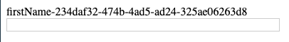

# use-unique-id

> A react hook for composing unique id&#x27;s with a prefix

[](https://www.npmjs.com/package/use-unique-id) [](https://standardjs.com)

## Install

```bash
npm install --save use-unique-id
```

## Usage

```tsx
import React from "react";

import { useUniqueId } from "use-unique-id";
import "./index.css";

const App = () => {
  return (
    <form>
      <label htmlFor="firstName">{useUniqueId("firstName")}</label>
      <input name="firstName" />
    </form>
  );
};
export default App;
```



## License

MIT © [HomeX Toolkit Team](https://github.com/HomeX Toolkit Team)

---

This hook is created using [create-react-hook](https://github.com/hermanya/create-react-hook).
