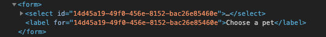
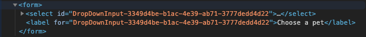

# useUniqueId

useUniqueId is a react hook that generates unique ids with a human readable prefix. You can assign unique ids using a react component's name as the prefix allowing you to see the component's name in a browser's developer tools without opening react dev tools. 

### Install


`npm install use-unique-id`

OR 

`yarn add use-unique-id`

### Usage

```jsx
useUniqueId('DropDownInput')
```

### Before
*using a random unique id generator*



### After
*using use-unique-id*



use-unique-id uses uuid/v4 under the hood generating reliable universally unique identifiers (UUIDs).

🚀 Made with [create-react-hook](https://github.com/hermanya/create-react-hook).

------------ 
### License

MIT © [HomeX Labs](https://github.com/homexlabs)
