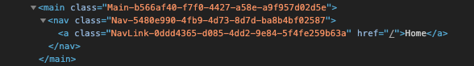

# use-unique-id

> This is a react hook useful for composing unique ids with a human readable prefix.

[](https://www.npmjs.com/package/use-unique-id) [](https://standardjs.com)

### Install

```bash
npm install --save use-unique-id
```

### Usage

```tsx
import React from "react";

import { useUniqueId } from "use-unique-id";
import "./style.css";

const App = () => {

import { useUniqueId } from "use-unique-id";
import 'style.css'

const App = () => {
  return (
    <main className={useUniqueId("Main")}>
      <nav className={useUniqueId("Nav")}>
        <a className={useUniqueId("NavLink")} href="/">
          Home
        </a>
      </nav>
    </main>
  );
};
export default App;
  );
};
export default App;
```

### Output



### License

MIT © [HomeX Labs](https://github.com/homexlabs)
